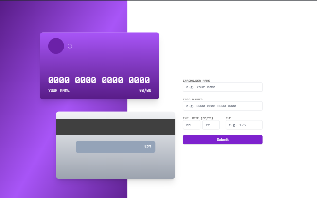
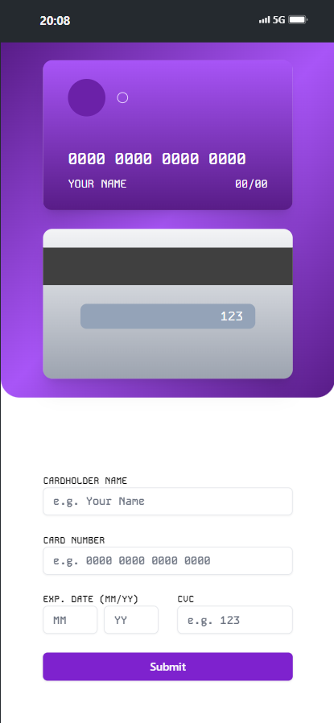

# Formulário de Cartão de Crédito

Bem-vindo ao repositório do meu formulário de cartão de crédito! Este projeto foi desenvolvido para demonstrar minhas habilidades em desenvolvimento web, utilizando as tecnologias React, Tailwind, TypeScript e Firebase.

## 🚀 Funcionalidades Principais

- **Validação de Formulário**: Validações em tempo real para os campos do cartão de crédito.
- **Formatação Automática**: Formatação automática do número do cartão de crédito.
- **Modal de Sucesso**: Exibição de um modal de sucesso após a submissão bem-sucedida.

## 🛠️ Tecnologias Utilizadas

- **React**: Biblioteca JavaScript para construção de interfaces de usuário.
- **Tailwind CSS**: Framework CSS utilitário para estilização rápida e eficiente.
- **TypeScript**: Superset do JavaScript que adiciona tipagem estática ao código.

## 📸 Screenshots




## 💼 Objetivo

Este projeto foi criado com o objetivo de demonstrar minhas habilidades em validação e formatação de formulários, buscando proporcionar uma experiência de usuário suave e intuitiva.

## 🔗 Links

- **Projeto Online**: [Credit Card form](https://github.com/raphaeleliass/creditcard-form)
- **Repositório no GitHub**: [GitHub](https://github.com/raphaeleliass/credit-card-form)

## ⚙️ Como Executar o Projeto

1. Clone o repositório:
   ```sh
   git clone https://github.com/raphaeleliass/credit-card-form
   ```
2. Navegue até o diretório do projeto:
   ```sh
   cd credit-card-form
   ```
3. Instale as dependências:
   ```sh
   npm install
   ```
4. Inicie o servidor de desenvolvimento:
   ```sh
   npm run dev
   ```

## 🤝 Contribuição

Contribuições são sempre bem-vindas! Se você tiver sugestões ou melhorias, por favor, abra uma issue ou envie um pull request.

## 📧 Contato

Se você quiser discutir sobre o projeto ou oportunidades de trabalho, sinta-se à vontade para me contatar:

- **LinkedIn**: [Meu Linkedin](https://linkedin.com/in/raphaeleliass/)
- **Instagram**: [Meu Instagram](https://instagram.com/raphaeleliass)
